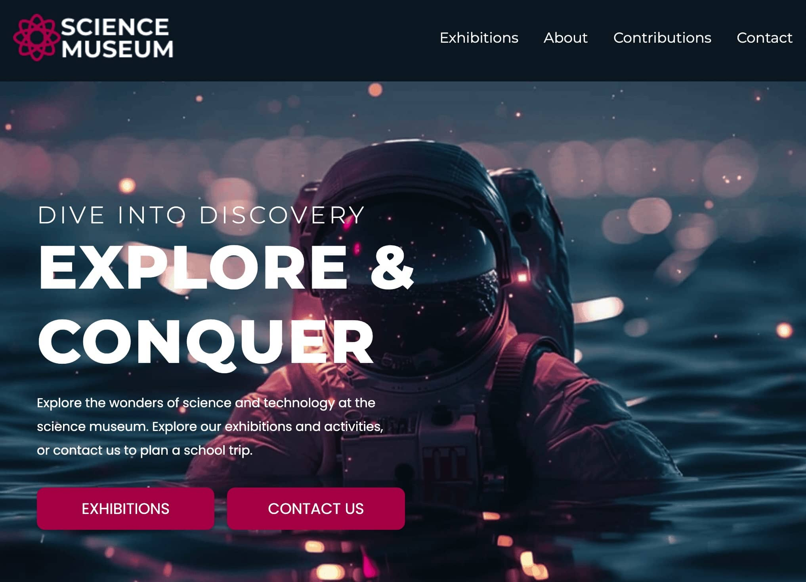

# Semester Project 1 - Science Museum



A modern, accessible, and responsive website for the **Community Science Museum**, designed to engage young audiences and families. The project focuses on delivering a user-friendly and visually appealing experience that excites visitors about science and encourages them to visit the museum.

## Description

The **Community Science Museum** website was developed as part of a semester project to simulate a real-world client brief. The goal was to create an engaging, informative, and accessible website for a science museum aimed at children (ages 7-15) and families.

The website includes the following pages:

- **Home page** – An introduction to the museum with key information and imagery.
- **Exhibitions page** – A showcase of current exhibitions and upcoming events.
- **Contributions page** – Information on how visitors can contribute to the museum.
- **Contact page** – Museum address, phone number, opening hours, and a contact form.
- **Privacy Policy & Terms and Conditions pages** – Legal documentation for visitors.

## Built With

This project was built using:

- **HTML5**
- **CSS3 (Vanilla CSS, no frameworks)**

## Getting Started

### Installing

To get a local copy of the project up and running:

1. Clone the repository:

```bash
git clone https://github.com/martinekong/semester-project-1.git
```

2. Open the project in you code editor

## Deployment

This site is deployed using GitHub pages:  
🔗 [Science Museum website](https://martinekong.github.io/FED1-SP1/)

## Contact

If you have any questions or feedback, feel free to reach out:

- [LinkedIn](https://www.linkedin.com/in/martine-kongsrud)
- Email: [martinekongrus@outlook.com](mailto:martinekongsrud@outlook.com)

## Acknowledgments

Special thanks to:

- Noroff for the project brief and resources.
- Teachers for valuable feedback and discussions.
- Freepik for the images
- SVG repo for all icons
